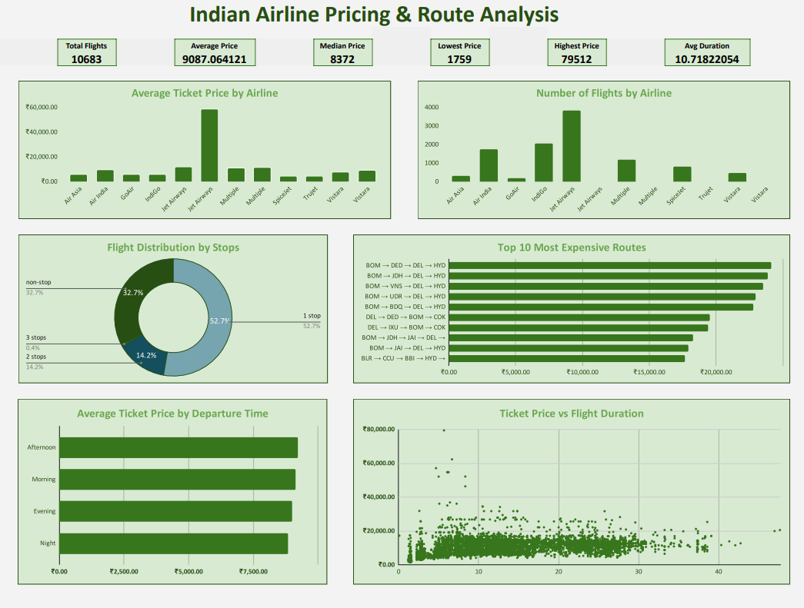

# Indian Airline Pricing & Route Analysis

## Project Overview

This project analyzes domestic airline ticket data in India to understand how airline, route, number of stops, departure timing, and flight duration relate to ticket prices.

The project uses Google Sheets for data cleaning, analysis, and dashboard development.

## Business Question

**How do airline, route, stops, timing, and flight duration influence ticket prices in the Indian domestic flight market?**

## Dataset

The dataset contains approximately 10,683 domestic flight records with information about:

- Airline
- Date of journey
- Source and destination
- Route
- Departure and arrival time
- Flight duration
- Number of stops
- Additional information
- Ticket price

**Source:** Kaggle — Indian Plane Ticket Price Dataset

## Data Preparation

The raw dataset was preserved separately and a cleaned copy was created for analysis.

Additional analytical fields were created:

- Journey Month
- Journey Day
- Departure Category
- Duration Hours

The `Duration Hours` field converts flight durations such as `23h 40m` into a numeric value for analysis.

## Analysis

The analysis focuses on:

- Average ticket price by airline
- Flight volume by airline
- Flight distribution by number of stops
- Most expensive routes
- Average ticket price by departure time
- Relationship between ticket price and flight duration

## Dashboard

The final dashboard contains six visualizations and key performance indicators covering ticket pricing, airline activity, routes, stops, departure timing, and flight duration.



## Key Metrics

The dashboard tracks:

- Total Flights
- Average Ticket Price
- Median Ticket Price
- Lowest Ticket Price
- Highest Ticket Price
- Average Flight Duration

## Tools Used

- Google Sheets
- Data Cleaning
- Spreadsheet Formulas
- Pivot/summary analysis
- Data Visualization
- Dashboard Design

## Project Structure

```text
indian-airline-pricing-analysis/
│
├── README.md
├── data_dictionary.md
│
├── analysis/
│   └── analysis_notes.md
│
└── dashboard/
    ├── indian_airline_dashboard.png
    └── indian_airline_dashboard.pdf
